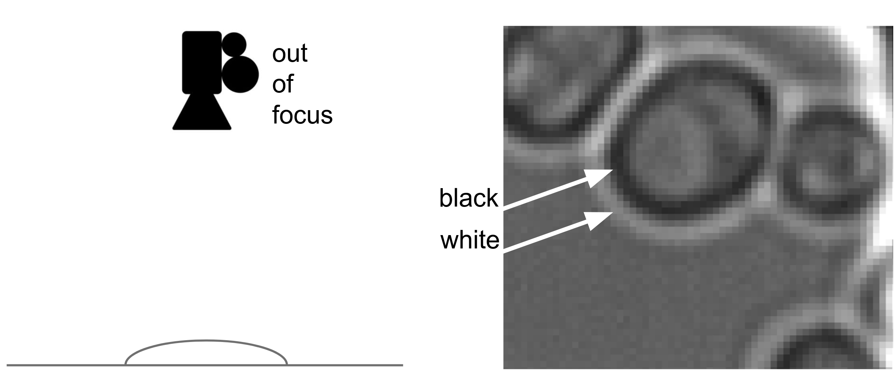

# Yeast cell and budding detection

Detecting yeast cells and their budding (multiplication) behavior in brightfield microscropy images.

## Participants

 * dr. Andreas Milias Argeitis, principal investigator, University of Groningen, Faculty of Science and Engineering
 * MSc. Paolo Guerra, second principal investigator, University of Groningen, Faculty of Science and Engineering
 * MSc Herbert Teun Kruitbosch, data scientist, University of Groningen, Data science team

(The data science team is a group of 10 data scientists and alike that assist researchers from all faculties with data science and scientific programming, as part of the universities Center of Information Technology)

## Project description

**Goal** Finding out the budding moment in time and identify the mother and child yeast cells based on brightfield microscopy images. 

**Data** The brightfield images are grayscale 512x512 images that measure a black-to-white border for each yeast cell, which is cause because the lense is slightly out of focus w.r.t. the prepared surface, measuring the surface deformation of the transparant cells by there volume. These are measured every 5 minutes, such that a movie of 200 to 300 frames is captured. 

<table>
  <tr>	
    <td>
  </tr>
  <tr>
    <td>Figure 1. Example of a mother cell with several buddings</td>
  </tr>
</table>

<table>
  <tr>	
    <td>
  </tr>
  <tr>
    <td>Figure 2. Concept of recording a brightfield image</td>
  </tr>
</table>
 
Although we had a lot of data, we didn't have many labels. Since the images look relatively easily, we've created synthetic data by rendering black and while elipses with elastic deformations and other types of noice, for training. Figure 3 shows predictions of both synthetic and actual data, made by a model trained on synthetic data.

<table>
  <tr>	
    <td>
  </tr>
  <tr>
    <td>Figure 3. Examples of synthetic data, the red areas are the labels.</td>
  </tr>
</table>
 
**Motivation** Budding behavior is important to understand cell multiplication in various biological research questions. The best tool so far is [yeast spotter](https://academic.oup.com/bioinformatics/article/35/21/4525/5490207), which allows very good detection of cells, but only has heuristics to find the budding moment and nothing to find the mother. Therefore researcher often do many manual annotations, and hence automation would speed up this type of research.

**Cell detection results** Using the synthetic data for training, we can get decent results on detecting cells. We're not interested in finding all cells, however, the precision should be high to avoid conclusions based on false positives.

<table>
  <tr>	
    <td>
  </tr>
  <tr>
    <td>Figure 4. Predictions by a model trained on synthetic data.</td>
  </tr>
</table>

**Boundary detection** Based on the cell location, we tracked the boundary via seam carving on a polar-coordinate transform. By transforming the polar coordinates, and finding the path along the angle-axis from 0 to 2 pi with highest or lowest cummulative pixel values, we get an estimate of where the boundary is. Highest cumulative value will locate the white, and lowest the black boundary. We took the average of both as the estimated boundary location.

ffmpeg -i boundary-example-01.mp4 -r 15 -vf scale=512:-1 -ss 00:00:00 -to 00:00:06 boundary-example-01.fig

<table>
  <tr>	
    <td>
        
    </td>
    <td>
        
    </td>
  </tr>
  <tr>
    <td colspan="2">Figure 5. Examples of boundary detection ausing seam carving.</td>
  </tr>
</table>

**Same cell detection** Out algorithm detected the cells in each time frame idependently, we used DBSCAN to cluster the detections that belong to the same cell over time, and consider a maximum time-distance of 2 frames.

<table>
  <tr>	
    <td>
        
    </td>
  </tr>
  <tr>
    <td>Figure 6. Example of a 3D point cloud of all detected cels over time.</td>
  </tr>
  <tr>
    <td>
        
    </td>
  <tr>
  <tr>
    <td>Figure 7. Cluster results, each line represents the movement of a cell over time.</td>
  </tr>
</table>

**Budding detection**

## Implementation

We created a notebook to run all steps.

 * [Entire pipeline](notebooks/Example.ipynb)

